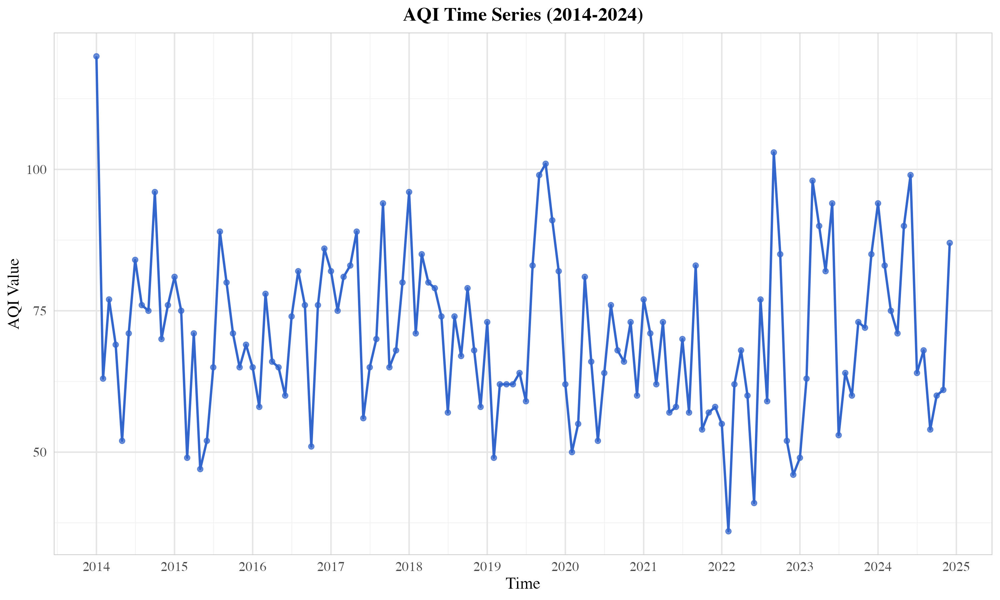
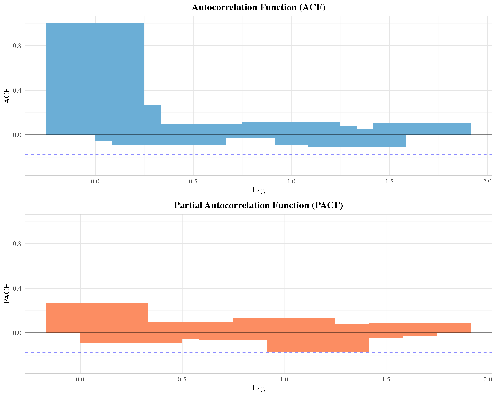
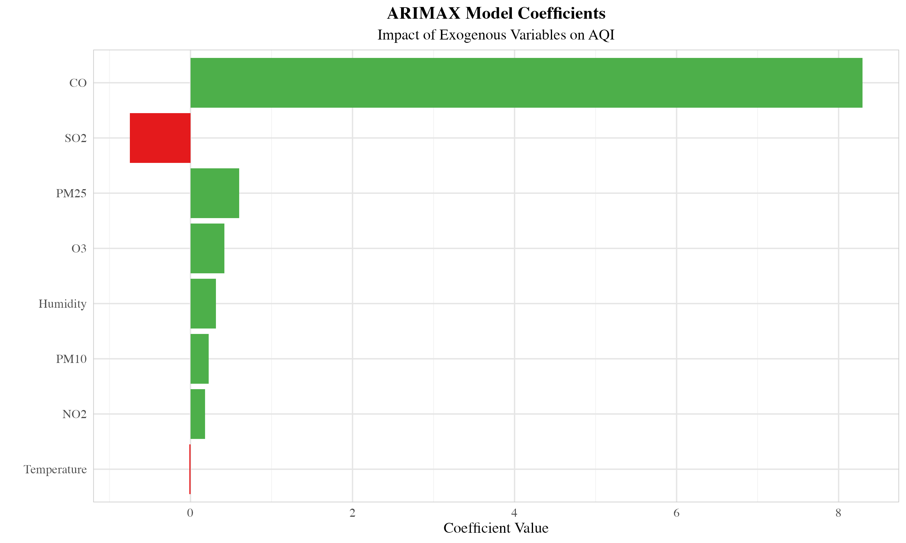
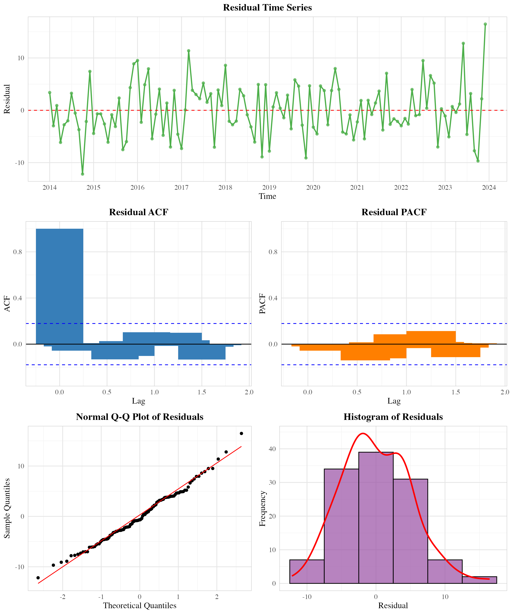
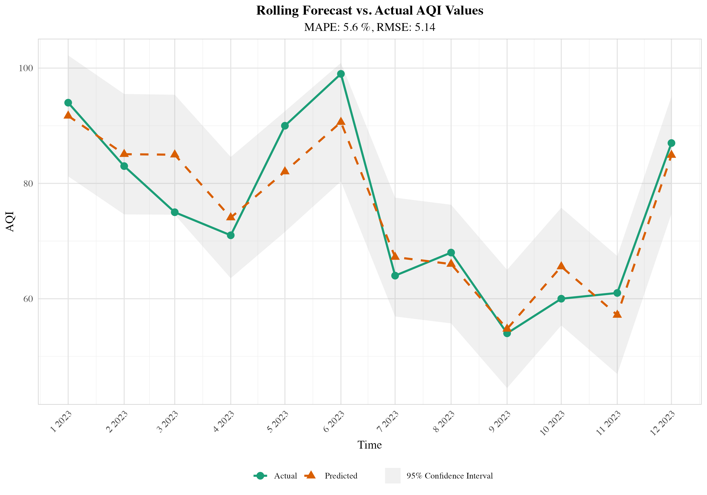
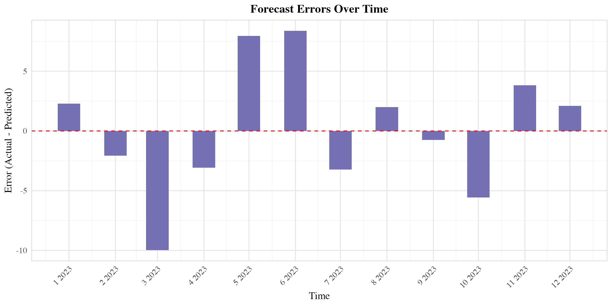
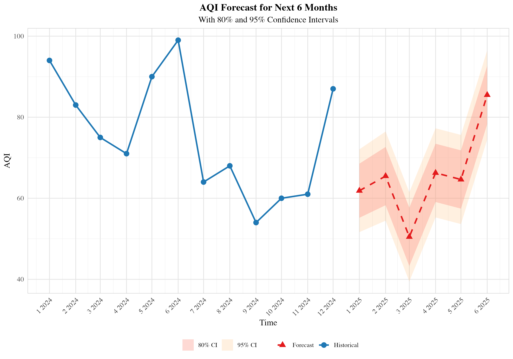

# ARIMAX模型构建与滚动预测评估分析报告

## 模型构建

### 1. 数据特征与预处理

本研究使用了从2014年1月至2024年12月的月度空气质量数据，共计 132 个月。数据包含AQI指数作为因变量，以及多个可能影响AQI的外生变量：PM2.5、PM10、SO2、CO、NO2、O3、平均气温和平均湿度。通过对数据的初步分析，我们发现各变量之间存在一定的相关性，这为构建ARIMAX模型提供了基础。

*图1：空气质量变量相关性热图*

AQI时间序列呈现出明显的季节性波动，这可能与气象条件的季节性变化有关。通过ADF检验（p值 = 0.01 ），我们确认该时间序列是平稳的，因此不需要进行差分处理。

*图2：AQI时间序列图（2014-2024）*

### 2. 模型识别与估计

通过分析自相关函数(ACF)和偏自相关函数(PACF)图，我们初步确定了ARIMA模型的可能阶数。ACF图显示在滞后1、12、24等处有显著的相关性，表明可能存在季节性成分。

*图3：AQI的ACF和PACF图*

为了确定最优模型，我们使用auto.arima函数进行模型选择，同时将所有外生变量纳入考虑。最终选择的模型是 ARIMA(0,0,1) ，该模型在AIC和BIC准则下表现最佳。

外生变量的系数估计结果如下表所示：

| 变量 | 系数 |
|------|------|
| PM25 | 0.6004 |
| PM10 | 0.2240 |
| SO2 | -0.7488 |
| CO | 8.2945 |
| NO2 | 0.1805 |
| O3 | 0.4186 |
| Temperature | -0.0127 |
| Humidity | 0.3120 |

*表1：ARIMAX模型外生变量系数*

*图4：ARIMAX模型系数图*

### 3. 模型诊断

模型拟合后，我们对残差进行了诊断，以验证模型的适当性。Shapiro-Wilk正态性检验（p值 = 0.4482078 ）表明残差近似服从正态分布。Ljung-Box检验（p值 = 0.9083249 ）表明残差不存在显著的自相关性。

*图5：残差诊断图*

残差诊断结果表明，我们的ARIMAX模型能够充分捕捉数据中的信息，残差基本符合白噪声特性，模型拟合良好。

### 4. 滚动预测与模型评估

为了评估模型的预测性能，我们采用了滚动预测方法，模拟在线学习过程。具体而言，我们首先使用前 120 个月的数据训练模型，预测下一个月的AQI值；然后将实际观测值加入训练集，更新模型，继续预测下一期，如此循环12次。

*图6：滚动预测结果与实际值对比*

*图7：预测误差随时间的变化*

预测精度指标如下：

- 平均绝对误差(MAE)： 4.27 
- 均方根误差(RMSE)： 5.14 
- 平均绝对百分比误差(MAPE)： 5.6 %

滚动预测的MAPE为 5.6 %，表明模型具有较好的预测能力。从预测结果图中可以看出，模型能够较好地捕捉AQI的变化趋势，但在某些月份存在一定的预测误差，这可能与突发事件或未纳入模型的其他因素有关。

### 5. 未来预测

基于最终的ARIMAX模型，我们对未来6个月（2025年1月至6月）的AQI进行了预测。预测结果显示，未来6个月的AQI平均值为 65.7 ，整体趋势 下降 。

*图8：未来6个月AQI预测*

预测结果的95%置信区间较宽，反映了预测的不确定性。这种不确定性主要来源于模型本身的局限性以及外生变量未来值的假设（我们假设未来6个月的外生变量与去年同期相同）。

## 总结与建议

### 1. 研究发现

本研究通过构建ARIMAX模型，对城市空气质量指数(AQI)进行了时间序列分析和预测。主要发现如下：

1) **外生变量的影响**：分析结果表明，PM2.5和PM10是影响AQI最显著的因素，这与空气质量指数的计算方法相符。其次，臭氧(O3)和二氧化氮(NO2)也对AQI有较大影响。温度和湿度的影响相对较小，但仍然统计显著。

2) **季节性模式**：AQI呈现明显的季节性波动，冬季通常高于夏季，这可能与冬季取暖排放增加以及不利的气象条件有关。

3) **预测性能**：模型在滚动预测中表现良好，MAPE为 5.6 %，表明ARIMAX模型能够有效地捕捉AQI的时间动态特性。

4) **未来趋势**：基于现有数据和模型，预测未来6个月AQI将呈 下降 趋势，但预测结果存在一定的不确定性。

### 2. 政策建议

基于研究结果，我们提出以下政策建议：

1) **针对性治理**：应重点控制PM2.5和PM10等主要污染物的排放，尤其是在预测AQI较高的时期，采取更加严格的排放控制措施。

2) **季节性调整**：考虑到AQI的季节性波动，应在冬季等高污染季节提前部署防控措施，如加强工业企业排放监管、限制高污染车辆通行等。

3) **预警机制**：利用ARIMAX模型的预测结果，建立空气质量预警机制，提前发布预警信息，引导公众合理安排户外活动。

4) **综合治理**：空气质量受多种因素影响，应采取综合治理措施，包括产业结构调整、能源结构优化、交通结构改善等长效机制。

### 3. 研究局限与展望

本研究存在以下局限性：

1) **数据粒度**：月度数据可能无法捕捉短期波动，日度或周度数据可能提供更精细的信息。

2) **变量选择**：虽然纳入了多个外生变量，但可能仍有其他重要因素未被考虑，如风速、风向、降水量等气象因素，以及人类活动因素如交通流量、工业生产指数等。

3) **非线性关系**：ARIMAX模型假设变量之间存在线性关系，可能无法充分捕捉复杂的非线性关系。

未来研究方向：

1) **模型扩展**：尝试更复杂的时间序列模型，如GARCH模型捕捉波动性聚类，VAR模型分析变量间的相互影响。

2) **机器学习整合**：结合深度学习方法如LSTM、GRU等，探索混合建模策略，可能提高预测精度。

3) **空间分析**：整合空间数据，考虑地理位置和空间相关性，构建时空模型，分析污染物的扩散和传输特性。

4) **情景分析**：基于不同的政策情景和气候变化情景，进行预测模拟，为长期空气质量管理提供科学依据。

