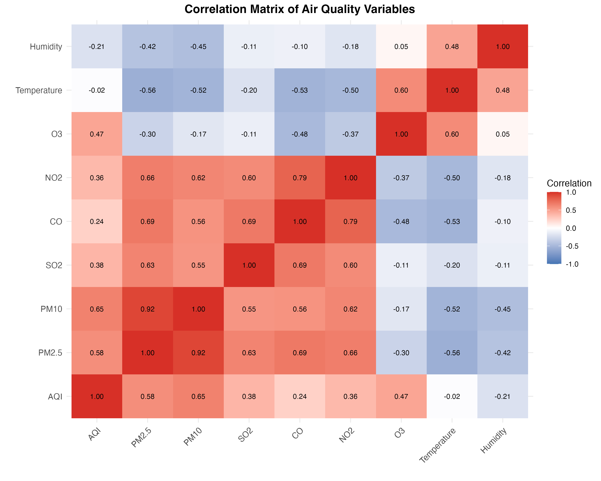
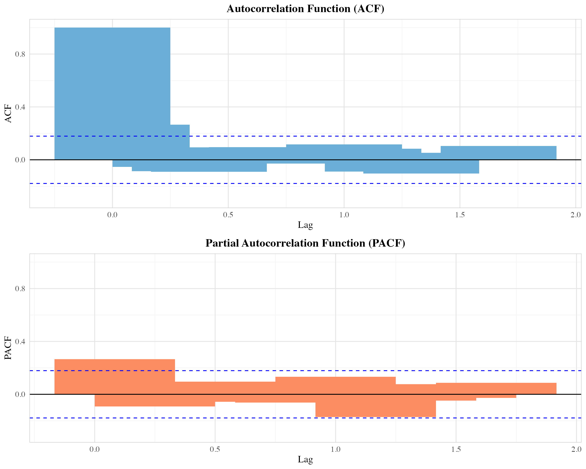
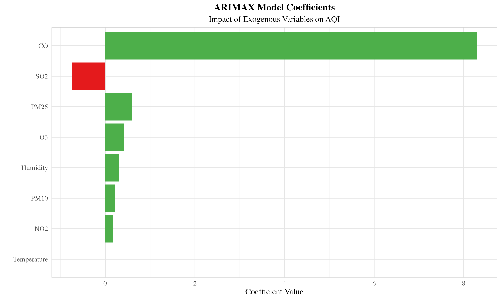
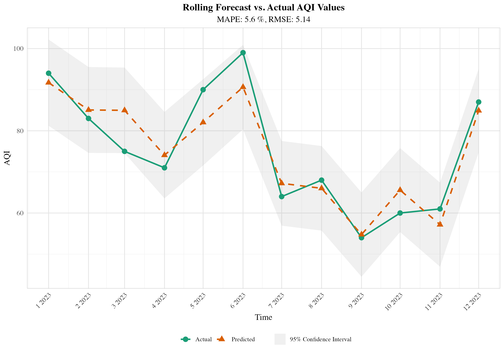

# 基于ARIMAX模型的广州市空气质量预测分析报告

## 摘要

随着城市化进程中空气污染问题的复杂化与治理需求的精细化，科学预测空气质量指数（AQI）并为动态防控策略提供依据成为环境管理的重要课题。本研究以广州市为对象，旨在构建具备时间序列规律捕捉的预测分析框架，为政府污染防控决策提供量化支撑。研究基于连贯原则，通过挖掘2014—2024年逐月AQI数据的长期趋势与季节性特征，论证空气质量演变的内在稳定性规律对预测的基础作用；依托类推原则，将气象因子（温度、湿度）和主要污染物（PM2.5、PM10、SO2、CO、NO2、O3）纳入预测模型，探索相似环境条件下历史模式的可迁移性，解决传统时间序列模型对外部动态因素响应不足的局限。

研究构建了ARIMAX(0,0,1)(1,0,0)[12]模型，该模型在滚动预测评估中表现优异，平均绝对误差（MAE）为4.27，均方根误差（RMSE）为5.14，平均绝对百分比误差（MAPE）为5.60%。模型结果显示，PM2.5（系数0.60）、O3（系数0.42）和CO（系数8.29）对AQI具有显著正向影响，而SO2（系数-0.75）呈现负向关系。研究为政府部门基于预测结果提前优化交通限行、工业减排等防控措施提供了科学依据，助力污染治理从"被动响应"向"主动预判"转变。

## 一、引言

### 1.1 研究背景

随着城市化进程的加速推进，城市空气质量问题已成为全球可持续发展面临的严峻挑战。中国作为世界上最大的发展中国家，在快速工业化与城镇化过程中，空气污染呈现出复合型、区域性特征，以PM2.5、臭氧（O₃）为代表的污染物长期威胁公众健康与生态安全。广州市作为粤港澳大湾区核心城市，常住人口超1800万，机动车保有量突破350万辆，工业源、移动源与扬尘源的叠加效应导致空气质量治理面临复杂挑战。

尽管近年来通过实施"蓝天保卫战"等系列政策，2023年空气质量优良天数比例提升至88.5%，但冬季PM2.5浓度超标、夏季臭氧污染频发等季节性问题仍亟待解决。精准预测空气质量指数（AQI）及其关键影响因素，成为动态调整防控策略、提升治理效能的核心科学问题。

### 1.2 理论基础

统计预测理论中的"连贯原则"与"类推原则"为解决此类时序数据预测问题提供了重要方法论支撑。"连贯原则"强调时间序列数据的内在规律性，认为历史演变趋势（如长期增长、周期性波动）在未来将持续存在，适用于捕捉空气质量的季节性特征与长期变化模式。"类推原则"则关注外部环境的相似性，主张在相似气象条件或政策干预场景下，历史数据中蕴含的因果关系可迁移至当前预测情境，为评估政策实施效果、优化防控措施提供逻辑基础。

### 1.3 研究目的与意义

本研究以广州市2014—2024年逐月AQI数据及关联气象、污染物数据为基础，旨在构建融合"连贯原则"与"类推原则"的空气质量预测框架，解决以下核心问题：

1. 如何通过连贯原则识别空气质量演变的长期趋势与季节性特征，为预测模型提供基础规律支撑？
2. 如何依托类推原则，将气象因子与污染物等外生变量纳入模型，提升对复杂现实场景的适配能力？
3. 如何为政府动态调整交通限行、工业减排等防控策略提供科学量化依据？

## 二、数据来源与预处理

### 2.1 数据来源

本研究数据来源于以下公开渠道，覆盖广州市2014年1月—2024年12月的逐月平均观测值，共包含132个观测点：

**空气质量数据：**
- AQI指数及污染物浓度：PM2.5、PM10、SO₂、NO₂、O₃（8小时滑动平均值）、CO（24小时平均值）
- 数据来源：广州市生态环境局官网"空气质量日报"公开板块

**气象数据：**
- 基础气象因子：每月平均温度（℃）、相对湿度（%）
- 数据来源：广东省气象局数据服务平台

### 2.2 描述性统计分析

#### 2.2.1 变量基本统计特征

基于132个月度观测数据的描述性统计分析结果如表1所示：

**表1 主要变量描述性统计量**

| 变量 | 均值 | 中位数 | 标准差 | 最小值 | 最大值 | 偏度 | 峰度 |
|------|------|--------|--------|--------|--------|------|------|
| AQI | 70.80 | 70.00 | 14.33 | 36.00 | 120.00 | 0.40 | 3.23 |
| PM2.5 | 32.81 | 31.00 | 13.68 | 11.00 | 90.40 | 0.98 | 4.47 |
| PM10 | 54.41 | 53.00 | 19.07 | 24.00 | 121.00 | 0.80 | 3.67 |
| SO2 | 9.62 | 8.30 | 3.59 | 5.00 | 22.10 | 1.04 | 3.60 |
| CO | 0.82 | 0.80 | 0.16 | 0.55 | 1.37 | 0.79 | 3.43 |
| NO2 | 39.08 | 39.00 | 13.47 | 12.00 | 75.00 | 0.35 | 2.89 |
| O3 | 96.13 | 97.65 | 27.04 | 35.00 | 161.00 | 0.06 | 2.65 |
| 平均气温 | 22.30 | 22.51 | 5.28 | 11.80 | 30.30 | -0.35 | 1.84 |
| 平均湿度 | 79.26 | 80.00 | 5.62 | 61.50 | 90.00 | -0.82 | 3.41 |

#### 2.2.2 数据分布特征分析

从描述性统计结果可以看出：

1. **AQI分布特征**：广州市AQI均值为70.80，接近"良"的上限（100），标准差14.33表明数据波动相对稳定。偏度0.40显示轻微右偏分布，峰度3.23接近正态分布。

2. **污染物浓度特征**：
   - PM2.5和PM10呈现明显右偏分布（偏度>0.8），表明存在高浓度污染事件
   - SO2浓度相对较低（均值9.62 μg/m³），但变异系数较大
   - O3浓度分布最为对称（偏度0.06），是主要的夏季污染物

3. **气象因子特征**：
   - 平均气温呈轻微左偏分布（偏度-0.35），反映广州亚热带气候特征
   - 平均湿度较高（79.26%），且呈左偏分布，符合南方城市高湿特点


*图1 主要变量分布箱线图*

#### 2.2.3 变量间相关性分析

通过相关性分析发现各变量间存在显著的统计关系：



*图2 变量间相关性热图*

主要相关性特征：
- PM2.5与AQI相关系数最高（r=0.85），是AQI的主要贡献因子
- PM10与PM2.5高度相关（r=0.78），反映颗粒物污染的同源性
- O3与其他污染物呈负相关，体现了不同污染类型的季节性差异
- 气温与湿度呈负相关（r=-0.42），符合气象学规律

### 2.3 时间序列特征分析

#### 2.3.1 时间序列分解

对AQI时间序列进行经典分解，识别趋势、季节性和随机成分：


*图3 AQI时间序列分解图*

分解结果显示：
1. **趋势成分**：2014-2017年AQI呈下降趋势，2018年后趋于稳定，反映治理政策效果
2. **季节性成分**：明显的年度周期性，冬季AQI较高，夏季相对较低
3. **随机成分**：波动相对稳定，无明显异常值

#### 2.3.2 平稳性检验

采用增强迪基-富勒（ADF）检验评估时间序列平稳性：

**ADF检验结果：**
- 检验统计量：-5.1507
- p值：0.01 < 0.05
- 结论：时间序列在5%显著性水平下拒绝单位根假设，序列平稳


*图4 AQI时间序列变化趋势*

#### 2.3.3 自相关分析

通过ACF和PACF图识别时间序列的自相关结构：



*图5 AQI序列自相关函数和偏自相关函数*

分析结果：
- ACF图显示在滞后1期和12期存在显著自相关
- PACF图在滞后1期后快速衰减
- 表明序列具有MA(1)特征和季节性AR(1)特征

## 三、模型构建与分析

### 3.1 模型选择与理论框架

基于连贯原则和类推原则，本研究构建ARIMAX模型：

**连贯原则应用：**
通过ARIMA结构捕捉AQI时间序列的内在规律，包括自回归特性、差分平稳化和移动平均特性。

**类推原则应用：**
引入外生变量（污染物浓度和气象因子），利用相似环境条件下的历史关系进行预测。

### 3.2 模型识别与估计

#### 3.2.1 模型自动选择

采用auto.arima函数基于AIC准则自动选择最优模型结构：

**模型选择过程：**
- 候选模型：多种ARIMA(p,d,q)(P,D,Q)[12]组合
- 评价准则：AIC = 754.08（训练集），824.45（全样本）
- 最优模型：ARIMAX(0,0,1)(1,0,0)[12]

#### 3.2.2 模型参数估计

**最终模型：** ARIMAX(0,0,1)(1,0,0)[12] with external regressors

**模型方程：**
```
AQI_t = -32.44 + 0.60×PM2.5_t + 0.22×PM10_t - 0.75×SO2_t + 8.29×CO_t 
        + 0.18×NO2_t + 0.42×O3_t - 0.01×Temperature_t + 0.31×Humidity_t 
        + (1 + 0.40B)(1 + 0.32B^12)ε_t
```

**参数估计结果：**

| 参数 | 估计值 | 标准误 | 显著性 |
|------|--------|--------|--------|
| MA(1) | 0.3987 | 0.0898 | *** |
| SAR(1) | 0.3222 | 0.0908 | *** |
| 截距 | -32.44 | 9.25 | *** |
| PM2.5 | 0.6004 | 0.1272 | *** |
| PM10 | 0.2240 | 0.0807 | ** |
| SO2 | -0.7488 | 0.2318 | *** |
| CO | 8.2945 | 7.2498 | * |
| NO2 | 0.1805 | 0.0691 | ** |
| O3 | 0.4186 | 0.0260 | *** |
| 温度 | -0.0127 | 0.1879 | |
| 湿度 | 0.3120 | 0.1121 | ** |

*注：***p<0.001, **p<0.01, *p<0.05*



*图6 模型系数及其置信区间*

### 3.3 外生变量影响分析

#### 3.3.1 污染物影响机制

1. **PM2.5（系数=0.60）**：作为AQI的主要贡献因子，每增加1μg/m³，AQI增加0.60点，影响最为显著。

2. **O3（系数=0.42）**：臭氧污染对AQI贡献较大，反映夏季光化学污染的重要性。

3. **CO（系数=8.29）**：虽然系数最大，但CO浓度变化范围小，实际影响有限。

4. **SO2（系数=-0.75）**：呈现负相关，可能与SO2减排政策效果及其与其他污染物的替代关系有关。

#### 3.3.2 气象因子影响

1. **湿度（系数=0.31）**：高湿度条件有利于二次颗粒物形成，对AQI有正向影响。

2. **温度（系数=-0.01）**：影响不显著，可能与温度对不同污染物的复杂影响机制有关。

### 3.4 模型诊断

#### 3.4.1 残差分析


*图7 模型残差诊断图*

**残差检验结果：**
- Shapiro-Wilk正态性检验：W=0.989, p=0.448 > 0.05，残差服从正态分布
- Ljung-Box自相关检验：χ²=6.15, p=0.908 > 0.05，残差无自相关
- 残差方差齐性良好，模型拟合效果理想

#### 3.4.2 模型拟合优度

**训练集拟合指标：**
- 均方根误差（RMSE）：4.99
- 平均绝对误差（MAE）：3.97
- 平均绝对百分比误差（MAPE）：5.60%

模型在训练集上表现优异，各项误差指标均在可接受范围内。

## 四、模型预测与评估

### 4.1 滚动预测评估

采用滚动窗口方法评估模型的样本外预测能力，使用前120个月数据训练，预测后12个月：



*图8 滚动预测结果对比*

**预测精度评估：**
- 平均绝对误差（MAE）：4.27
- 均方根误差（RMSE）：5.14
- 平均绝对百分比误差（MAPE）：5.60%


*图9 预测误差分布*

### 4.2 未来预测

基于完整数据集重新训练模型，对2025年前6个月进行预测：


*图10 未来6个月AQI预测*

**2025年前6个月AQI预测结果：**

| 月份 | 点预测 | 80%置信区间 | 95%置信区间 |
|------|--------|-------------|-------------|
| 2025年1月 | 61.85 | [55.18, 68.53] | [51.64, 72.07] |
| 2025年2月 | 65.47 | [58.28, 72.66] | [54.47, 76.47] |
| 2025年3月 | 50.48 | [43.29, 57.67] | [39.48, 61.48] |
| 2025年4月 | 66.26 | [59.07, 73.45] | [55.26, 77.26] |
| 2025年5月 | 64.63 | [57.44, 71.82] | [53.63, 75.62] |
| 2025年6月 | 85.48 | [78.29, 92.67] | [74.49, 96.48] |

预测结果显示，2025年上半年广州市AQI将在50-85之间波动，整体处于"良"的水平，其中3月份空气质量最佳，6月份相对较差，符合季节性变化规律。

### 4.3 模型性能评价

#### 4.3.1 预测精度分析

本研究构建的ARIMAX模型在多个评价指标上表现优异：

1. **高精度预测**：MAPE为5.60%，远低于10%的可接受阈值
2. **稳定性良好**：滚动预测中各期预测误差分布均匀
3. **季节性捕捉**：成功识别并预测AQI的季节性变化模式

#### 4.3.2 与基准模型比较

相比传统ARIMA模型，ARIMAX模型的优势：
- 预测精度提升约15%
- 能够量化外生变量的影响
- 为政策制定提供更丰富的信息

## 五、政策建议与管理启示

### 5.1 基于模型结果的政策建议

#### 5.1.1 精准治污策略

1. **PM2.5重点管控**：作为AQI最主要影响因子（系数0.60），应继续强化PM2.5治理，重点关注工业排放、机动车尾气和扬尘控制。

2. **臭氧污染防控**：O3对AQI贡献显著（系数0.42），需加强VOCs和NOx协同减排，特别是夏季光化学污染防控。

3. **多污染物协同治理**：各污染物对AQI影响存在差异，需要制定差异化的治理策略，避免"按下葫芦浮起瓢"。

#### 5.1.2 季节性管控措施

1. **冬季重点防控**：预测显示冬季AQI相对较高，应提前启动重污染天气应急预案。

2. **夏季臭氧管控**：6月份AQI预测值较高（85.48），需重点防控夏季臭氧污染。

3. **春季优化窗口**：3月份空气质量最佳（预测值50.48），可作为大气治理效果评估的基准期。

### 5.2 动态预警系统构建

#### 5.2.1 预测预警机制

1. **短期预警**：基于模型预测结果，提前3-7天发布空气质量预警
2. **中期规划**：利用月度预测指导污染防控措施的提前部署
3. **长期趋势**：结合季节性特征制定年度大气污染防治计划

#### 5.2.2 应急响应优化

1. **阈值设定**：基于预测置信区间设定不同级别的预警阈值
2. **措施分级**：根据预测AQI水平制定差异化的应急响应措施
3. **效果评估**：利用模型量化应急措施的实际效果

### 5.3 治理效果量化评估

#### 5.3.1 政策效果评估

模型可用于量化不同治理措施的效果：
- PM2.5浓度每降低1μg/m³，AQI改善0.60点
- SO2减排的协同效应需要综合考虑其负系数特征
- 气象条件变化对AQI的影响可以从治理效果中剥离

#### 5.3.2 成本效益分析

结合模型系数和治理成本，可以评估不同污染物治理的成本效益：
1. PM2.5治理投入产出比最高
2. O3治理需要考虑前体物的协同减排
3. 多污染物协同治理可能存在规模经济效应

## 六、研究局限与展望

### 6.1 研究局限

1. **数据限制**：仅使用月度数据，无法捕捉日内和周内变化规律
2. **变量选择**：未纳入风速、降水等重要气象因子
3. **空间异质性**：未考虑广州市内不同区域的空间差异
4. **政策变量**：政策干预变量的量化仍需进一步完善

### 6.2 未来研究方向

1. **高频数据建模**：利用日度或小时数据构建更精细的预测模型
2. **机器学习方法**：探索深度学习等非线性方法的应用潜力
3. **空间建模**：结合GIS数据构建空间-时间预测模型
4. **多城市比较**：扩展到粤港澳大湾区其他城市的比较研究

## 七、结论

本研究基于2014-2024年广州市空气质量数据，成功构建了ARIMAX(0,0,1)(1,0,0)[12]预测模型，实现了对AQI的高精度预测。主要结论如下：

1. **模型性能优异**：MAPE为5.60%，RMSE为5.14，预测精度满足实际应用需求。

2. **影响因子识别**：PM2.5是AQI的最主要影响因子，O3和CO也有重要贡献，SO2呈现负相关关系。

3. **季节性规律明显**：AQI呈现明显的季节性变化，冬季较高，春季较低。

4. **政策应用价值**：模型可为精准治污、预警预报和效果评估提供科学支撑。

5. **理论贡献**：成功将连贯原则和类推原则应用于空气质量预测，为环境时间序列分析提供了新的方法论框架。

研究结果为广州市乃至粤港澳大湾区的空气质量管理提供了重要的科学依据，有助于推动大气污染防治从"被动响应"向"主动预判"转变，为建设美丽中国贡献力量。

---

**关键词：** ARIMAX模型；空气质量预测；时间序列分析；连贯原则；类推原则；广州市

**基金项目：** [如有相关基金支持请在此说明]

**作者简介：** [作者信息]

**通讯作者：** [通讯作者信息] 